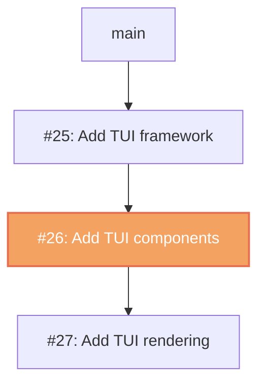
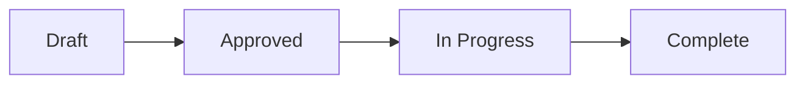

# Pull Request Workflow

## Step 1: Detect Mode

Check whether a PR already exists for this branch:

```bash
gh pr view --json number,title,body,url 2>/dev/null
```

- **PR exists** → Update mode: collect context, rewrite title and body, run `gh pr edit`
- **No PR** → Create mode: collect context, build title and body, run `gh pr create`

## Step 2: Detect Stacked PR Environment

Determine whether this branch is part of a PR stack — a chain of PRs where each targets the previous branch instead of main/master.

### 2a. Check the base branch

```bash
gh pr view --json number,title,baseRefName,headRefName,url 2>/dev/null
```

If `baseRefName` is **not** `main` or `master`, this PR is likely part of a stack.

### 2b. Walk the full stack

Build the ordered chain by walking in both directions from the current branch:

**Walk up** (toward main): Starting from the current PR's `baseRefName`, repeatedly look for a PR whose `headRefName` matches that base:

```bash
gh pr list --head "<base-branch>" --json number,title,baseRefName,headRefName,url --limit 1
```

Continue until `baseRefName` is `main`/`master` or no PR is found.

**Walk down** (away from main): Starting from the current PR's `headRefName`, look for PRs that target it as their base:

```bash
gh pr list --base "<head-branch>" --json number,title,headRefName,url
```

Continue recursively until no child PRs are found.

### 2c. Build the stack diagram

If a stack is detected (2+ PRs in the chain), generate a Mermaid diagram for the PR body. Requirements:

- Use `flowchart TD` (top-down, main at the top)
- Each PR is a node labeled with `#number: short title`
- The `main` root node appears at the top of the chain
- The **current PR's node** uses the `current` class for visual highlighting
- Each PR node has a `click` action linking to its PR URL
- Apply a `classDef` to distinguish the current PR

Example for a 3-PR stack where PR #26 is the current one:

````markdown

````

If the branch is **not** part of a stack, skip this step entirely.

## Step 3: Gather Full Branch Context

Always base the PR on the **totality of commits** on this branch, not just the latest:

```bash
git log main...HEAD --oneline            # all commits
git diff main...HEAD --stat              # all files changed
git diff main...HEAD                     # full diff
```

## Step 4: Derive the Title

### 4a. Select Tags

Scan changed files and commit messages to pick domain/area tags. Use as many as apply:

| Tag | When to use |
|-----|-------------|
| `[api]` | API endpoints, request/response types |
| `[ui]` | Frontend components, styles, templates |
| `[db]` | Database schemas, queries, migrations |
| `[auth]` | Authentication, authorization, permissions |
| `[ci]` | CI/CD pipelines, GitHub Actions, workflows |
| `[doc]` | Documentation, READMEs, changelogs |
| `[config]` | Configuration files, settings, env vars |
| `[test]` | Test files, test infrastructure |
| `[internal]` | Internal packages, shared libraries |
| `[setup]` | Setup, installation, provisioning scripts |
| `[template]` | Embedded templates, scaffolding assets |
| `[deps]` | Dependency updates, go.mod, package.json |
| `[skill]` | Agent skills, slash command definitions |
| `[agent]` | Agent definitions, subagent configs |

Derive additional tags from top-level directory names or package names when none of the above fit.

### 4b. Pick a Type

| Type | Use when |
|------|----------|
| `feat` | New feature or capability |
| `fix` | Bug fix |
| `refactor` | Code restructuring without behavior change |
| `docs` | Documentation only |
| `chore` | Maintenance, cleanup, dependency bumps |

### 4c. Detect Ticket ID from Branch Name

Check the branch name for tracker patterns:

| Pattern | Example branch | Extracted ID |
|---------|---------------|--------------|
| `[A-Z]+-\d+` | `feature/PROJ-123-add-auth` | `PROJ-123` |
| `[a-z]+-\d+` | `fix/eng-456-login-bug` | `ENG-456` |
| `#\d+` or `\d+-` at start | `42-update-docs` | `#42` |

### 4d. Assemble the Title

**Without ticket:**
```
[tag1][tag2] type: short description
```

**With ticket:**
```
[tag1][tag2] type: short description (TICKET-ID)
```

- Keep the short description under 60 characters
- Derive it from the full set of commits — summarize the logical change, not just the last commit
- Example: `[skill][agent] feat: add checkbox progress tracking to plan workflow (ENG-42)`

## Step 5: Build the PR Body

Always derive the body from the **full branch diff** — rewrite completely on updates, never append to stale content.

### When to include a Mermaid diagram

Add a diagram when changes involve any of:
- A **state machine or lifecycle** (e.g. plan status transitions)
- **Data or control flow** between components
- **Architectural changes** (new packages, service dependencies)
- **Sequence of operations** across systems or agents
- **Before/after structure** that is clearer visually than in prose

Use GitHub-compatible fenced blocks:

````

````

Supported diagram types: `flowchart`, `sequenceDiagram`, `stateDiagram-v2`, `classDiagram`, `erDiagram`, `gitGraph`.

### PR Body Template

```markdown
[If stacked PR detected in Step 2: insert the PR Stack diagram from Step 2c here, before Summary]

## Summary

- [What changed and why — 2–5 bullet points covering the full scope of the branch]

[Optional: Mermaid diagram if a flow, architecture, or state machine is involved]

## Changes

[Group related file changes under subheadings. Each group gets 1–2 sentences explaining the change.]

## Issue Reference

[Include only if a ticket ID was detected in the branch name]
Closes [TICKET-URL or #issue-number]

## Test Plan

- [ ] [Local test item 1]
- [ ] [Local test item 2]
- [ ] CI passes on push
```

## Step 6: Execute the Test Plan

Work through each test plan item actively — do not leave all boxes unchecked.

### Local items
For each `- [ ]` item that can be run locally:
1. Run the test or verification
2. If it passes, update the PR body: change `- [ ]` to `- [x]`
3. Push the updated body with `gh pr edit --body "..."`

### CI verification
After pushing:
```bash
gh run list --branch <branch> --limit 5        # find the latest run
gh run watch <run-id>                          # stream live status
```
Once CI passes, check off the CI item in the PR body and update with `gh pr edit`.

### Updating the checklist
Keep the PR body's test plan in sync with actual results. A reviewer should see which items have been verified and which are still pending.

## Step 7: Create or Update

**Create:**
```bash
gh pr create --title "<title>" --body "<body>"
```

**Update (PR already exists):**
```bash
gh pr edit --title "<title>" --body "<body>"
```

## Rules

- Never push directly to main/master
- Title must reflect the **totality of commits** on the branch, not just the most recent
- Body must be **rewritten from the full diff** each time — never patch stale content
- Always run local test items before checking them off
- Always wait for CI to pass before checking off the CI item
- Keep PRs focused — one logical change per PR
- When a ticket ID is in the branch name, always include the Issue Reference section
- When a PR stack is detected, always include the stack diagram at the top of the body and regenerate it on updates to reflect the latest stack state
