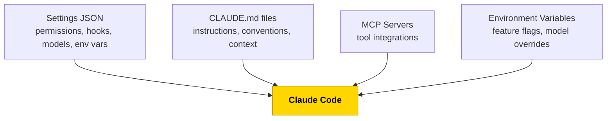
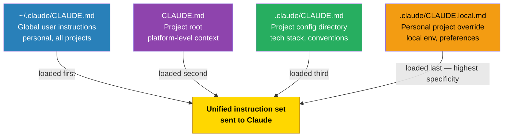
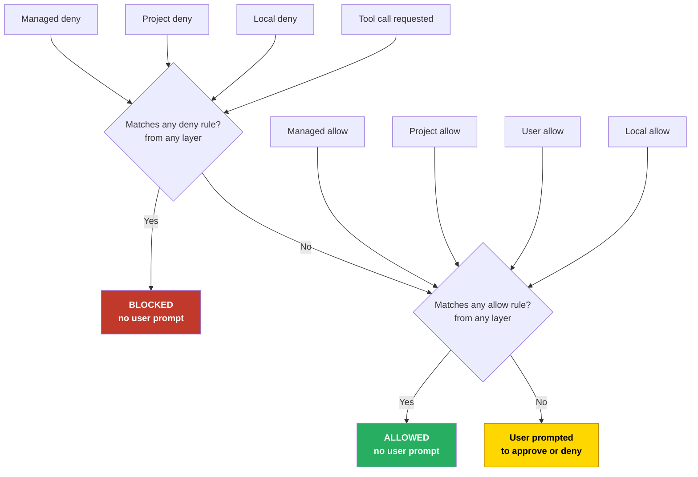
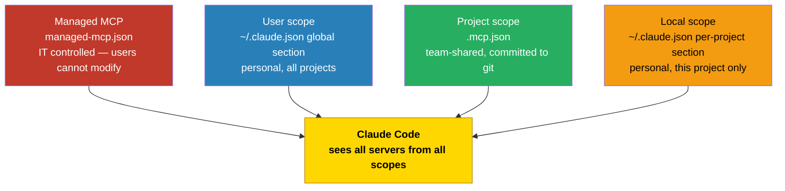
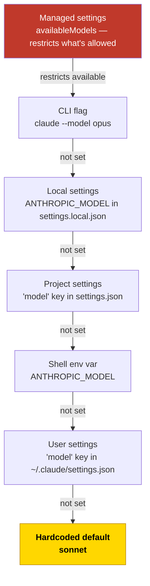

# Configuration Reference

This document covers every configuration layer Claude Code reads, how they stack, and what wins when layers conflict. Read this before tuning permissions, CLAUDE.md instructions, MCP scopes, or model selection.

---

## Table of Contents

1. [The Four Configuration Surfaces](#1-the-four-configuration-surfaces)
2. [Settings Layering](#2-settings-layering)
3. [Prompt Layering (CLAUDE.md)](#3-prompt-layering-claudemd)
4. [Permission Coalescing](#4-permission-coalescing)
5. [MCP Scope Resolution](#5-mcp-scope-resolution)
6. [Model Resolution Order](#6-model-resolution-order)
7. [Environment Variables](#7-environment-variables)
8. [Configuration File Reference](#8-configuration-file-reference)

---

## 1. The Four Configuration Surfaces

Claude Code reads configuration from four distinct surfaces. Each surface has its own precedence rules and coalescing behavior.



| Surface | What it controls | Who manages it |
|---|---|---|
| **Settings JSON** | Permissions, hooks, models, env vars, UI behavior | Admin or developer |
| **CLAUDE.md files** | Instructions, conventions, context | Developer or team |
| **MCP servers** | Tool access, external integrations | Developer or IT |
| **Environment variables** | Feature flags, model overrides, telemetry | Developer or CI |

---

## 2. Settings Layering

Claude Code merges settings from five sources in strict precedence order. **Lower numbers win** — layer 1 (managed) overrides everything.

```mermaid
flowchart LR
    U["5 · User Settings<br/>~/.claude/settings.json"]
    P["4 · Project Settings<br/>.claude/settings.json"]
    L["3 · Local Settings<br/>.claude/settings.local.json"]
    C["2 · CLI Arguments<br/>--model, --debug, etc."]
    M["1 · Managed Settings<br/>managed-settings.json"]

    U -->|"overridden by"| P
    P -->|"overridden by"| L
    L -->|"overridden by"| C
    C -->|"overridden by"| M

    classDef managed fill:#c0392b,color:#fff,font-weight:bold
    classDef cli fill:#e67e22,color:#fff
    classDef local fill:#f39c12,color:#000
    classDef project fill:#27ae60,color:#fff
    classDef user fill:#2980b9,color:#fff

    class M managed
    class C cli
    class L local
    class P project
    class U user

    click M href "https://docs.anthropic.com/en/docs/claude-code/settings#managed-policy-settings" _blank
    click U href "https://docs.anthropic.com/en/docs/claude-code/settings" _blank
    click P href "https://docs.anthropic.com/en/docs/claude-code/settings" _blank
    click L href "https://docs.anthropic.com/en/docs/claude-code/settings" _blank
```



**For scalar keys** (model name, boolean flags, string values): the highest-precedence source that defines the key wins. If project settings set `"model": "sonnet"` and local settings set `"model": "haiku"`, local wins.

**Managed settings** are deployed by IT/DevOps via MDM or config management to a system directory. Users cannot override them. They enforce org-wide policies like model restrictions and required hooks.

| Layer | File Path | Shared via Git? | Overridable? |
|---|---|---|---|
| Managed | `/Library/Application Support/ClaudeCode/managed-settings.json` (macOS) | No — MDM | No |
| CLI args | N/A (runtime flags) | No | Overrides everything below |
| Local | `.claude/settings.local.json` | No (gitignored) | Overrides project + user |
| Project | `.claude/settings.json` | Yes | Overrides user |
| User | `~/.claude/settings.json` | No | Lowest precedence |

> Full schema reference: [Claude Code Settings](https://docs.anthropic.com/en/docs/claude-code/settings)

### What belongs where

| Setting | Layer | Reason |
|---|---|---|
| Safety hooks | Project | Every team member needs them |
| Permission allow/deny | Project + global user | Team defaults + personal additions |
| Default model | Project | Cost control per project |
| Feature flag env vars | Project | Consistent behavior across team |
| Personal model override | Local | Individual preference |
| Additional directories | Local | Personal workspace layout |
| Org-wide model restrictions | Managed | Governance |
| Org-wide MCP allowlists | Managed | Security policy |

---

## 3. Prompt Layering (CLAUDE.md)

Unlike settings JSON, CLAUDE.md files **do not override each other** — they are all loaded and concatenated. Claude receives a single unified instruction set assembled from every active file.



When the same topic appears in multiple files, Claude applies a **more specific wins** heuristic — later-loaded instructions take precedence for the same directive. For example, a global instruction to "use npm" is overridden by a local instruction to "use bun for this project."

### Path-specific rules

Files in `.claude/rules/` with a `paths:` frontmatter are only injected when Claude operates on matching files:

```markdown
---
paths:
  - "src/api/**/*.ts"
---
These rules only apply when editing API route files.
```

### CLAUDE.md imports

Use `@` syntax to pull in other files from within a CLAUDE.md:

```markdown
See @README.md for project overview.
@docs/ARCHITECTURE.md
```

> Full CLAUDE.md loading reference: [Claude Code Memory](https://docs.anthropic.com/en/docs/claude-code/memory)

### This platform's three-layer architecture

| Layer | File | Managed by | Committed? |
|---|---|---|---|
| **Global** | `~/.claude/CLAUDE.md` | Platform setup script | No |
| **Project** | `.claude/CLAUDE.md` | Team | Yes |
| **Personal** | `.claude/CLAUDE.local.md` | Individual | No (gitignored) |

---

## 4. Permission Coalescing

Permissions use a **union + deny-wins** model. Allow lists from all active sources are merged into one set. Deny rules from any source always override allows — a match in any deny list blocks the tool call.



**The rule:** Deny always wins. A tool call matching a deny rule in any layer is blocked regardless of what allow rules say.

### Permission syntax

```
"Bash(git push *)"       — Allow/deny bash with a specific command prefix
"Bash(rm -rf /)"         — Exact command block
"Read(./.env)"           — Block reads of a specific file
"Read(./**/*.key)"       — Block reads matching a glob pattern
"WebSearch"              — Allow/deny an entire tool category
"mcp__*"                 — Allow all MCP tools (wildcard)
"mcp__github__*"         — Allow all tools from a specific MCP server
```

> Full permission syntax: [Claude Code Permissions](https://docs.anthropic.com/en/docs/claude-code/settings#permissions)

### Platform defaults

The global user settings installed by `claude-workspace setup` include a broad allow list covering common dev tools (git, npm/yarn/pnpm/bun, cargo, go, python, docker, brew, etc.) so Claude can work without prompting for routine commands.

The project deny list blocks the most dangerous operations:

| Denied pattern | Why |
|---|---|
| `rm -rf /` and `rm -rf ~` | Irreversible filesystem destruction |
| `git push --force` and `git push -f` | Overwrites shared history |
| `git reset --hard` and `git clean -f` | Discards uncommitted work |
| `curl * \| bash` and `wget * \| sh` | Arbitrary remote code execution |
| `chmod 777 *` | Makes files world-writable |
| `Read(./.env)` and `Read(./**/*.key)` | Prevents reading secrets into context |

---

## 5. MCP Scope Resolution

MCP servers registered at all scopes are **additive** — Claude has access to the union of every registered server. Scope only controls who shares the configuration and who can modify it.



| Scope | File | Shared? | Best for |
|---|---|---|---|
| Managed | System directory `managed-mcp.json` | All org users (MDM) | Org-wide approved servers |
| User | `~/.claude.json` global section | No | Servers you use across all projects |
| Project | `.mcp.json` in repo root | Yes (git) | Servers the whole team uses |
| Local | `~/.claude.json` per-project section | No | Personal servers for this project |

### Secrets and credentials

MCP credentials (API keys, bearer tokens, OAuth tokens) are **never stored in `.mcp.json`**. They are stored in your local Claude config (`~/.claude.json`) so secrets stay out of git while the server definition is shared.

Credentials are entered via masked prompt when using `claude-workspace mcp add --api-key` or `--bearer`.

> Full MCP configuration reference: [Claude Code MCP](https://docs.anthropic.com/en/docs/claude-code/mcp)

### This platform's defaults

Three servers are registered at project scope in `.mcp.json` (shared with the team):

| Server | Purpose |
|---|---|
| `memory` | Persistent knowledge graph (mcp-memory-libsql) |
| `filesystem` | Scoped file operations within the project directory |
| `git` | Git repository operations |

Additional servers added via `claude-workspace mcp add` default to local scope (personal, not committed).

---

## 6. Model Resolution Order

The active model is resolved by walking down this chain and taking the first value found:



Managed settings don't pick a model directly — they restrict which models are **available** via the `availableModels` array. All other sources select the active model, CLI flag taking highest priority.

### Per-subagent model overrides

Agents in `.claude/agents/` declare their model in frontmatter:

```yaml
---
name: explorer
model: haiku
---
```

`CLAUDE_CODE_SUBAGENT_MODEL` overrides all per-agent frontmatter simultaneously — useful for forcing a cheaper model in CI or during cost audits.

| Override mechanism | Scope | Priority |
|---|---|---|
| `model:` in agent frontmatter | That agent only | Lowest |
| `ANTHROPIC_MODEL` env var | All sessions on this machine | Medium |
| `CLAUDE_CODE_SUBAGENT_MODEL` env var | All subagents | Overrides frontmatter |
| `/model opus` slash command | Current session only | Session override |
| `--model opus` CLI flag | Session started with flag | Highest user-controlled |

> Model override reference: [Claude Code Model Selection](https://docs.anthropic.com/en/docs/claude-code/settings#model)

---

## 7. Environment Variables

Variables set under the `env` key in `.claude/settings.json` are injected into every Claude Code session started in that project. Personal overrides belong in `settings.local.json`.

### Platform variables

| Variable | Set in | Purpose | Platform default |
|---|---|---|---|
| `ANTHROPIC_API_KEY` | Shell profile or vault | API authentication | (required) |
| `ANTHROPIC_MODEL` | `settings.local.json` | Personal model override | — |
| `CLAUDE_CODE_SUBAGENT_MODEL` | `settings.json` | Model for all subagents | `opus` |
| `CLAUDE_CODE_EXPERIMENTAL_AGENT_TEAMS` | `settings.json` | Enable agent teams | `1` |
| `CLAUDE_CODE_ENABLE_TASKS` | `settings.json` | Enable task tracking | `true` |
| `CLAUDE_CODE_ENABLE_TELEMETRY` | `settings.json` | OpenTelemetry telemetry | `1` |
| `CLAUDE_AUTOCOMPACT_PCT_OVERRIDE` | `settings.json` | Auto-compact threshold % | `80` |

### OpenTelemetry variables

Add these to the `env` block in `settings.json` to route telemetry to your collector:

| Variable | Purpose | Example value |
|---|---|---|
| `OTEL_METRICS_EXPORTER` | Metrics exporter type | `otlp` |
| `OTEL_EXPORTER_OTLP_ENDPOINT` | Collector endpoint | `http://localhost:4317` |
| `OTEL_TRACES_EXPORTER` | Traces exporter type | `otlp` |

---

## 8. Configuration File Reference

Every file Claude Code reads, with paths and git status.

| File | Path | In Git? | Purpose |
|---|---|---|---|
| Managed settings | `/Library/Application Support/ClaudeCode/managed-settings.json` (macOS) | No (MDM) | Org-enforced policies |
| Global user settings | `~/.claude/settings.json` | No | Personal defaults for all projects |
| Project settings | `.claude/settings.json` | Yes | Team hooks, permissions, model, env |
| Local settings | `.claude/settings.local.json` | No (gitignored) | Personal project overrides |
| Global CLAUDE.md | `~/.claude/CLAUDE.md` | No | Personal instructions for all projects |
| Project CLAUDE.md | `.claude/CLAUDE.md` | Yes | Team conventions and tech stack |
| Local CLAUDE.md | `.claude/CLAUDE.local.md` | No (gitignored) | Personal project notes |
| Project MCP | `.mcp.json` | Yes | Team MCP server definitions |
| Local Claude config | `~/.claude.json` | No | MCP secrets, local server configs |
| Managed MCP | `managed-mcp.json` (system dir) | No (MDM) | Org-enforced MCP servers |
| Path rules | `.claude/rules/*.md` | Yes | File-pattern-scoped instructions |
| Auto-memory | `~/.claude/projects/<proj>/memory/MEMORY.md` | No | Claude's automatic session notes |

### JSON schema autocompletion

The platform settings files reference the official JSON Schema. Open `.claude/settings.json` in VS Code or any schema-aware editor to get inline field completion and documentation:

```json
{
  "$schema": "https://json.schemastore.org/claude-code-settings.json"
}
```
