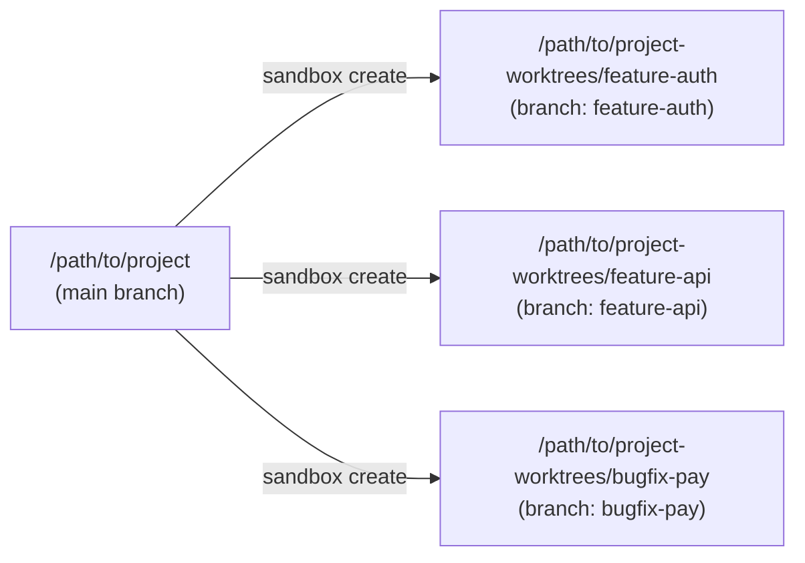
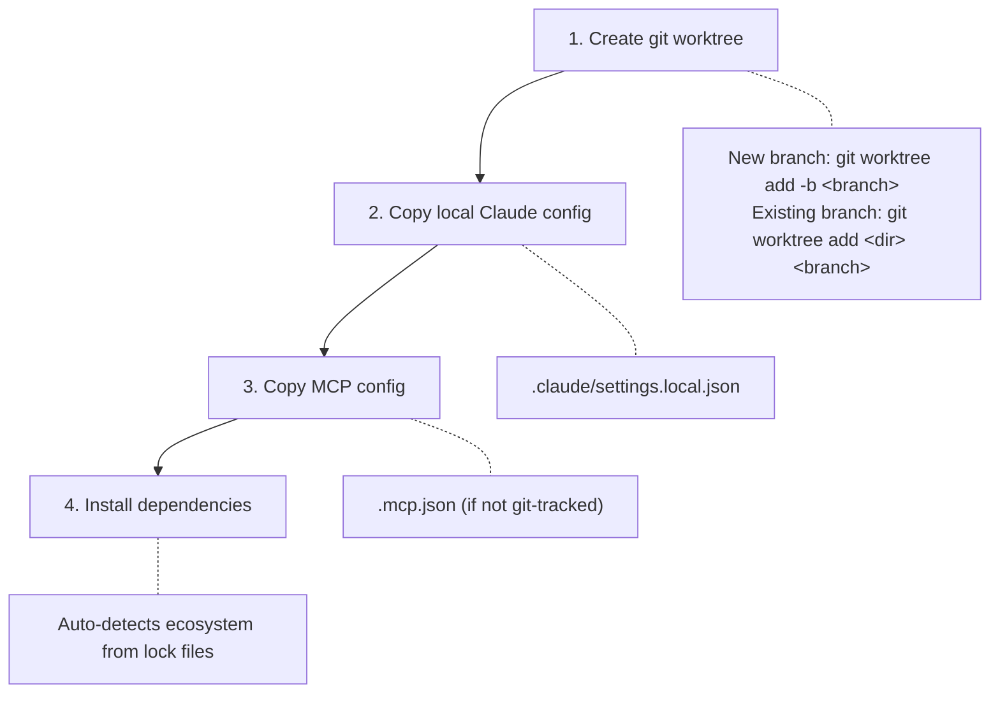

# Sandbox

The sandbox system creates isolated git worktrees for running parallel Claude Code sessions against the same repository. Each sandbox gets its own branch and working directory while sharing git history with the original repo.

## How It Works



Sandboxes are standard git worktrees placed in a sibling directory named `<project>-worktrees/`:

```
/path/to/project/                         # original repo
/path/to/project-worktrees/               # worktree base directory
/path/to/project-worktrees/feature-auth/  # one worktree per branch
/path/to/project-worktrees/feature-api/
/path/to/project-worktrees/bugfix-pay/
```

## Quick Start

```bash
# Create sandboxes for parallel work
claude-workspace sandbox create /path/to/project feature-auth
claude-workspace sandbox create /path/to/project feature-api

# Open separate terminals for each
cd /path/to/project-worktrees/feature-auth && claude   # Terminal 1
cd /path/to/project-worktrees/feature-api && claude    # Terminal 2

# List active sandboxes
claude-workspace sandbox list /path/to/project

# Clean up when done
claude-workspace sandbox remove /path/to/project feature-auth
```

## What Create Does

The `sandbox create` command runs four steps:



### Step 1: Git worktree

If the branch already exists, it checks it out into the worktree. Otherwise, it creates a new branch from the current HEAD.

### Step 2: Copy local configuration

Git-tracked files (`.claude/settings.json`, `.claude/CLAUDE.md`, agents, hooks, skills) are already present in the worktree. The create step copies only gitignored local files that would otherwise be missing:

| File | Purpose |
|------|---------|
| `.claude/settings.local.json` | Personal settings overrides |

### Step 3: Copy MCP configuration

Copies `.mcp.json` into the worktree if it exists in the source project and is not already present (i.e., not git-tracked).

### Step 4: Install dependencies

Auto-detects and installs dependencies for the project's language ecosystem. Multiple ecosystems can be detected in the same worktree.

| Ecosystem | Detection files | Install command |
|-----------|----------------|-----------------|
| JavaScript (Bun) | `bun.lockb`, `bun.lock` | `bun install` |
| JavaScript (npm) | `package-lock.json` | `npm ci` |
| JavaScript (Yarn) | `yarn.lock` | `yarn install` |
| JavaScript (pnpm) | `pnpm-lock.yaml` | `pnpm install` |
| JavaScript (fallback) | `package.json` | `npm install` |
| Ruby | `Gemfile.lock`, `Gemfile` | `bundle install` |
| Python (Poetry) | `poetry.lock` | `poetry install` |
| Python (uv) | `uv.lock` | `uv sync` |
| Python (pip) | `requirements.txt` | `pip install -r` |
| Java (Maven) | `pom.xml` | `mvn dependency:resolve` |
| Java (Gradle) | `build.gradle`, `build.gradle.kts` | `./gradlew dependencies` or `gradle dependencies` |
| .NET | `*.csproj`, `*.sln` | `dotnet restore` |
| Elixir | `mix.exs` | `mix deps.get` |
| PHP | `composer.lock`, `composer.json` | `composer install` |
| Swift | `Package.swift` | `swift package resolve` |
| Scala | `build.sbt` | `sbt update` |

## Commands

### sandbox create

```bash
claude-workspace sandbox create <project-path> <branch-name>

# Backward-compatible shorthand (omitting "create")
claude-workspace sandbox <project-path> <branch-name>
```

Creates a worktree at `<project>-worktrees/<branch-name>`. Idempotent — if the worktree already exists, prints a message and exits without error.

### sandbox list

```bash
claude-workspace sandbox list <project-path>
```

Lists all sandboxes under `<project>-worktrees/`, showing each sandbox's branch name and directory with a total count.

### sandbox remove

```bash
claude-workspace sandbox remove <project-path> <branch-name>
```

Removes the worktree and prunes stale references. Fails if the worktree has uncommitted changes — commit or discard them first. Removes the `<project>-worktrees/` base directory if it becomes empty.

## TUI

The interactive TUI (`claude-workspace` with no arguments) includes a **Sandbox** menu group with Create, List, and Remove actions. Each action presents a form for the project path (with filesystem autocomplete) and branch name, then runs the corresponding CLI command.

## Important Behaviors

- **Idempotent create** — Running create for an existing worktree is a no-op (no error, no re-copy of config, no re-install of deps).
- **Branch detection** — Create checks if the branch exists before deciding whether to create a new one or check out an existing one.
- **Dirty worktree protection** — Remove refuses to delete a worktree with uncommitted changes.
- **Symlink-aware listing** — List resolves symlinks when comparing paths (handles macOS `/var` → `/private/var`).
- **Git repo required** — All subcommands validate the target path is a git repository.

## See Also

- [CLI Reference — sandbox commands](CLI.md#claude-workspace-sandbox-create)
- [Getting Started — Parallel Development](GETTING-STARTED.md#9-parallel-development)
- [Architecture — Sandboxing](ARCHITECTURE.md)
