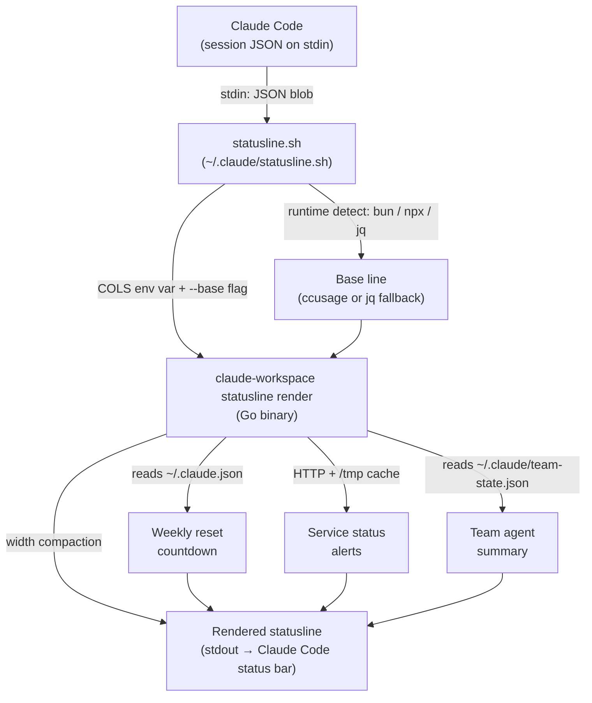
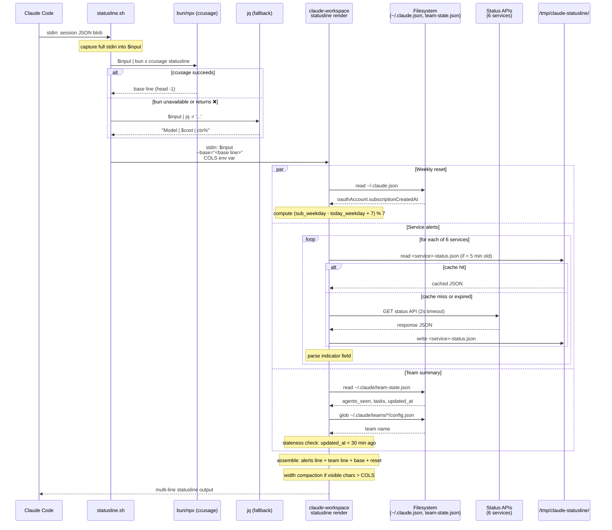

# Statusline

The statusline is a live status bar rendered inside every Claude Code session after each assistant message. It is implemented as a two-layer pipeline: a Bash script gathers raw session data, then the `claude-workspace` Go binary computes additional indicators, applies width compaction, and writes the final output.

## Architecture



## Data Call Flow

The following sequence shows exactly what happens from the moment Claude Code triggers the statusline command to the moment output appears.



## Output Structure

The statusline produces up to three lines, each omitted when not applicable:

```
Line 1: [service alerts]     — only when incidents are active
Line 2: [team summary]       — only when a team session is running
Line 3: [metrics + reset]    — always present if data is available
```

---

## Layer 1 — Shell Script (`statusline.sh`)

**Location:** `~/.claude/statusline.sh` (written by `claude-workspace statusline`)

**Responsibilities:**
- Capture the session JSON blob from stdin
- Detect available runtime and produce the base metrics line
- Measure terminal width via `tput cols`
- Delegate the rest to the Go binary

### Runtime Detection

The script tries three options in priority order:

| Priority | Runtime | Command |
|----------|---------|---------|
| 1 | `bun` | `bun x ccusage statusline` |
| 2 | `npx` | `npx -y ccusage statusline` |
| 3 | `jq` fallback | Inline jq expression |

`head -1` is applied to the ccusage output to guard against multi-line error messages. If ccusage returns an empty string or a line beginning with `❌`, the script falls back to jq.

### jq Fallback Format

When ccusage is unavailable, jq extracts three fields directly from the session JSON:

```
<model.display_name> | $<cost.total_cost_usd> | <context_window.used_percentage>% ctx
```

**Example:**
```
Claude Sonnet 4.6 | $0.032 | 18% ctx
```

### Go Binary Fallback

If `claude-workspace` is not in `$PATH`, the script prints only the base line and exits — no reset countdown, no service alerts, no team summary, no width compaction.

---

## Layer 2 — Go Binary (`claude-workspace statusline render`)

**Entry point:** `internal/statusline/render.go` → `Render()`

**Inputs:**
- `stdin`: raw session JSON blob (passed through from the shell script)
- `--base=<string>`: the pre-computed base metrics line
- `$COLS`: terminal width (integer string, default 120)
- `$CLAUDE_AUTOCOMPACT_PCT_OVERRIDE`: custom auto-compact threshold (default 95.0)

The binary computes four things in parallel and assembles the final output:

1. [Weekly reset countdown](#indicator-weekly-reset-countdown)
2. [Service status alerts](#indicator-service-status-alerts)
3. [Team agent summary](#indicator-team-agent-summary)
4. [Width compaction](#width-compaction)

---

## Indicator: Metrics Line

The metrics line is the base output from ccusage or jq, optionally enriched with the weekly reset countdown.

### ccusage Output (full)

When `bun` or `npx` is available and ccusage succeeds:

```
Opus | $0.23 session / $1.23 today / $0.45 block (2h 45m left) | $0.12/hr | 25,000 (12%)
```

| Field | Source |
|-------|--------|
| Model name | `model.display_name` in session JSON |
| Session cost | Running cost for the current session |
| Today's cost | Aggregate cost since midnight |
| Block cost + time | Cost within the current usage block and time remaining |
| Hourly rate | Derived from session cost and elapsed time |
| Token count + % | `context_window.used_percentage` from session JSON |

### jq Fallback Output

When ccusage is unavailable:

```
Claude Sonnet 4.6 | $0.032 | 18% ctx
```

### Condition for display

Always shown if any data source (ccusage or jq) produces output. Never shown if both fail.

---

## Indicator: Weekly Reset Countdown

**Source:** `~/.claude.json` → `oauthAccount.subscriptionCreatedAt` (RFC 3339 timestamp)

**Processing:**
1. Read `~/.claude.json` from the user's home directory
2. Parse `subscriptionCreatedAt` to extract the weekday of subscription creation
3. Compute `days = (sub_weekday - today_weekday + 7) % 7` (UTC)
4. Map to a human-readable string

| Result | Condition |
|--------|-----------|
| `resets today` | `days == 0` |
| `resets tomorrow` | `days == 1` |
| `resets in Nd` | `days >= 2` (e.g., `resets in 3d`) |
| _(omitted)_ | `~/.claude.json` missing, no `subscriptionCreatedAt`, or parse error |

**Combined with base line:**

```
Opus | $0.23 session / $1.23 today | $0.12/hr | 25,000 (12%) | resets in 3d
```

---

## Indicator: Service Status Alerts

**Source:** Six cloud service status APIs, cached in `/tmp/claude-statusline/`

### Monitored Services

| Service | API | Response Format |
|---------|-----|----------------|
| GitHub | `https://www.githubstatus.com/api/v2/status.json` | Atlassian Statuspage |
| Claude | `https://status.claude.com/api/v2/status.json` | Atlassian Statuspage |
| Cloudflare | `https://www.cloudflarestatus.com/api/v2/status.json` | Atlassian Statuspage |
| AWS | `https://health.aws.amazon.com/public/currentevents` | JSON array of events |
| Google Cloud | `https://status.cloud.google.com/incidents.json` | JSON incidents array |
| Azure DevOps | `https://status.dev.azure.com/_apis/status/health?api-version=7.1-preview.1` | Health object |

### Caching

Each service response is stored in `/tmp/claude-statusline/<service>-status.json`. The cache TTL is **5 minutes**. On a cache hit, the file is read directly without an HTTP request. On a network error or timeout (2-second limit), the stale cache is used as a fallback.

### Parsing & Severity

**Atlassian Statuspage** (GitHub, Claude, Cloudflare): parse `status.indicator`

| `indicator` | Condition |
|-------------|-----------|
| `"none"` or `""` | Healthy — no alert |
| `"minor"`, `"degraded"` | Warning severity |
| `"major"`, `"critical"` | Critical severity |

**AWS**: non-empty JSON array → critical alert; empty array → healthy

**Google Cloud**: incidents where `most_recent_update.status != "AVAILABLE"` → active; severity = critical if any incident has `"severity": "high"`, otherwise warning

**Azure DevOps**: `status.health != "healthy"` → alert; `"unhealthy"` → critical, anything else → warning

### Formatting

| Severity | Prefix | Color |
|----------|--------|-------|
| Critical / major | `🚨` | Red bold |
| Warning / minor | `⚠️` | Yellow bold |

Multiple alerts appear on a single line, space-separated.

### Examples

All services healthy — line omitted entirely.

Single critical alert:
```
🚨 GitHub: Major System Outage
```

Mixed alerts:
```
🚨 GitHub: Major System Outage  ⚠️  Claude: Degraded Performance
```

Multiple critical:
```
🚨 GitHub: Major System Outage  🚨 AWS: Active Incidents (3)  ⚠️  Cloudflare: Partial Outage
```

---

## Indicator: Team Agent Summary

**Source:** `~/.claude/team-state.json` (written by the `check-teammate-idle.sh` TeammateIdle hook)

**Condition for display:** File must exist, `updated_at` must be within the last 30 minutes, and either `agents_seen` or task counts must be non-empty.

### Data Source

The TeammateIdle hook writes `~/.claude/team-state.json` each time a teammate goes idle during a team session. The Stop hook (`clear-team-state.sh`) deletes the file when the session ends.

```json
{
  "updated_at": "2026-03-01T14:30:00Z",
  "agents_seen": ["researcher", "coder", "tester"],
  "tasks": {
    "pending": 2,
    "in_progress": 1,
    "completed": 3
  }
}
```

### Team Name Resolution

The team name is resolved from the most-recently-modified file in `~/.claude/teams/`:
1. `~/.claude/teams/*/config.json` → read `name` field
2. `~/.claude/teams/*.json` → read `name` field
3. Fallback: directory name, then filename stem, then `"team"`

### Format

```
👥 <team-name>  [<agent dots>]  <progress bar>  <N>/<total> tasks  ▶<n>  ⏸<n>  ✓<n>
```

| Component | Description |
|-----------|-------------|
| `👥 team-name` | Team name in bold |
| `[▶ ▶ ⏸]` | One dot per agent: green `▶` = active (running a task), yellow `⏸` = idle |
| `████████░░` | 10-char progress bar: green `█` filled proportional to completed/total |
| `N/total tasks` | Completed / total task count (omitted if total is 0) |
| `▶N` | In-progress task count (green) |
| `⏸N` | Pending task count (yellow) |
| `✓N` | Completed task count (gray) |

Active agent count = `min(in_progress_tasks, agent_count)`.

### Examples

Early in a session (3 agents, 1 task running, 5 pending, 0 done):
```
👥 my-project  [▶ ⏸ ⏸]  ░░░░░░░░░░  0/6 tasks  ▶1  ⏸5  ✓0
```

Mid-session (3 agents, 2 running, 3 done out of 8):
```
👥 my-project  [▶ ▶ ⏸]  ████░░░░░░  3/8 tasks  ▶2  ⏸3  ✓3
```

Near completion (1 agent left, 7 of 8 done):
```
👥 my-project  [▶]  █████████░  7/8 tasks  ▶1  ⏸0  ✓7
```

Session ends or state is older than 30 minutes — line omitted entirely.

---

## Width Compaction

When Claude Code's "Context left until auto-compact: N%" indicator is active (context usage ≥ 95%), it occupies the right side of the **first line** of statusline output. The Go binary detects this and compacts the affected line to avoid overlap.

### First-Line Routing

CC places its autocompact indicator on the first output line. The compaction logic determines which of our lines is first and applies width reservation only to that line:

| First line | CC reserve applied to | Metrics line width |
|------------|----------------------|-------------------|
| Alerts (service incidents active) | Alerts line | Full terminal width (no reserve) |
| Team summary (no alerts) | Team line (not compacted) | Full terminal width |
| Metrics (no alerts, no team) | Metrics line | `cols - ccReserve` |

This means when service alerts are present, the metrics line gets the full terminal width because CC's indicator shares the alerts line, not the metrics line.

### Metrics Line: Progressive Degradation

When the metrics line needs compaction, it degrades through 8 steps, stopping at the first that fits within `maxW`:

| Step | Action | Example result |
|------|--------|---------------|
| 0 | Full result (base + reset) | `🤖 Opus 4.6 \| 💰 $16.84 session / $18.35 today / $18.35 block (1h 1m left) \| 🔥 $4.88/hr \| 🧠 5,803 (3%) \| resets today` |
| 1 | Drop reset suffix | `🤖 Opus 4.6 \| 💰 $16.84 session / $18.35 today / $18.35 block (1h 1m left) \| 🔥 $4.88/hr \| 🧠 5,803 (3%)` |
| 2 | Drop hourly rate (🔥) | `🤖 Opus 4.6 \| 💰 $16.84 session / $18.35 today / $18.35 block (1h 1m left) \| 🧠 5,803 (3%)` |
| 3 | Drop block cost sub-segment | `🤖 Opus 4.6 \| 💰 $16.84 session / $18.35 today \| 🧠 5,803 (3%)` |
| 4 | Drop daily cost sub-segment | `🤖 Opus 4.6 \| 💰 $16.84 session \| 🧠 5,803 (3%)` |
| 5 | Abbreviate "session" → "sess" | `🤖 Opus 4.6 \| 💰 $16.84 sess \| 🧠 5,803 (3%)` |
| 6 | Drop tokens/context (🧠) | `🤖 Opus 4.6 \| 💰 $16.84 sess` |
| 7 | Plain model + $cost fallback | `Opus 4.6 \| $16.84 \| resets today` |
| 8 | Truncate with "…" | `Opus 4.6 \| $16.…` |

### Alerts Line Compaction

When the alerts line is the first line and CC's indicator is active, alerts are also compacted:

| Step | Action | Example result |
|------|--------|---------------|
| 0 | Full alerts | `⚠️ Cloudflare: Minor Service Outage (63h 31m)` |
| 1 | Drop duration parentheticals | `⚠️ Cloudflare: Minor Service Outage` |
| 2 | Abbreviate service names | `⚠️ CF: Minor Service Outage` |
| 3 | Truncate with "…" | `⚠️ CF: Minor Servi…` |

Service name abbreviations: Cloudflare → CF, Google Cloud → GCP, Azure DevOps → Azure, Active Incidents → Incidents.

### Algorithm Summary

1. Read terminal width from `$COLS` (default 120)
2. Check `context_window.used_percentage` from session JSON
3. If `used_percentage >= threshold` (default 95%, overridable via `$CLAUDE_AUTOCOMPACT_PCT_OVERRIDE`):
   - Compute `ccReserve = len("  Context left until auto-compact: N%")`
   - Determine which output line is first (alerts → team → metrics)
   - Apply compaction only to the first line; other lines get full terminal width
4. If CC indicator is not active: no compaction at all (full content, terminal wraps if needed)

### Examples

**Full line fits (wide terminal, CC idle):**
```
Opus | $0.23 session / $1.23 today / $0.45 block (2h 45m left) | $0.12/hr | 25,000 (12%) | resets in 3d
```

**Progressive degradation (CC active, metrics is first line, ~100 cols):**
```
🤖 Opus 4.6 | 💰 $16.84 session / $18.35 today | 🧠 5,803 (3%)
```

**Alerts compacted (CC active, alerts is first line):**
```
⚠️ CF: Minor Service Outage
🤖 Opus 4.6 | 💰 $16.84 session / $18.35 today / $18.35 block (1h 1m left) | 🔥 $4.88/hr | 🧠 5,803 (3%) | resets today
```

**Plain fallback (very narrow):**
```
Opus 4.6 | $16.84 | resets today
```

**Truncated (extremely narrow):**
```
Opus 4.6 | $16.…
```

---

## Full Output Examples

### Typical session (wide terminal, all services healthy, no team)

```
Claude Sonnet 4.6 | $0.04 session / $0.21 today | $0.02/hr | 8,400 (4%) | resets in 5d
```

### Session with ccusage (bun available)

```
Sonnet | $0.04 session / $0.21 today / $0.00 block | $0.02/hr | 8,400 (4%) | resets tomorrow
```

### Service outage active

```
🚨 GitHub: Major System Outage  ⚠️  Claude: Degraded Performance
Sonnet | $0.04 session / $0.21 today | $0.02/hr | 8,400 (4%) | resets in 2d
```

### Team session running

```
👥 my-project  [▶ ▶ ⏸]  █████░░░░░  3/6 tasks  ▶2  ⏸1  ✓3
Opus | $1.20 session / $3.40 today | $0.60/hr | 45,000 (22%) | resets in 3d
```

### All indicators active

```
🚨 AWS: Active Incidents (2)  ⚠️  Cloudflare: Partial Outage
👥 auth-refactor  [▶ ▶ ▶ ⏸]  ████████░░  8/10 tasks  ▶3  ⏸0  ✓7 (idle)
Opus | $2.10 session / $5.60 today / $0.80 block (45m left) | $1.05/hr | 68,000 (33%) | resets today
```

### Fallback (no claude-workspace binary)

```
Sonnet | $0.04 session / $0.21 today | $0.02/hr | 8,400 (4%)
```

---

## Setup

The statusline is configured automatically during `claude-workspace setup` (step 9 of 9), or on demand:

```bash
claude-workspace statusline
```

This writes `~/.claude/statusline.sh` and registers it in `~/.claude/settings.json`:

```json
{
  "statusLine": {
    "type": "command",
    "command": "bash ~/.claude/statusline.sh",
    "padding": 0
  }
}
```

The command is idempotent — re-running it skips configuration if `statusLine` is already set. Use `--force` to overwrite.

To configure manually within a Claude Code session, use the `/statusline-setup` skill.

### Environment Variables

| Variable | Default | Purpose |
|----------|---------|---------|
| `$COLS` | `120` | Terminal width (set automatically by `tput cols`) |
| `$CLAUDE_AUTOCOMPACT_PCT_OVERRIDE` | `95.0` | Context usage threshold for reserving auto-compact indicator space |
